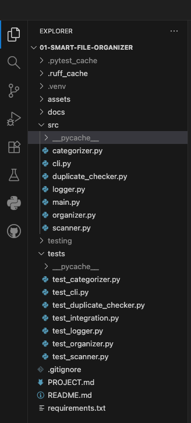
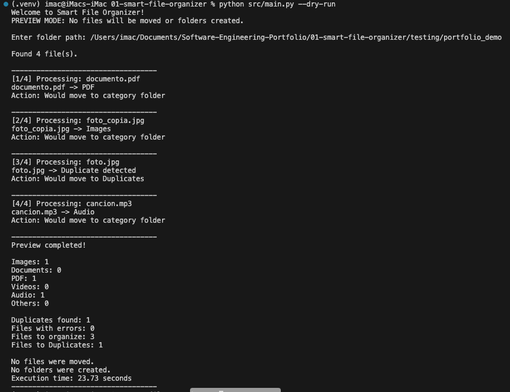
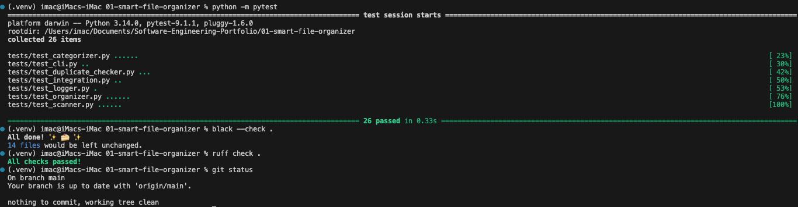

# Smart File Organizer

A Python-based file organization tool that automatically scans a selected folder, categorizes files by type, detects duplicates, and moves files into organized category folders.

The project was developed as a software engineering portfolio project, with an emphasis on modular architecture, automated testing, clean code, and practical file-system automation.


## Features

- Automatic file categorization
- Image, document, PDF, video, audio, and other file categories
- Duplicate file detection using SHA-256 hashing
- Dedicated `Duplicates` folder for duplicate files
- Automatic filename conflict handling
- Hidden file detection and exclusion
- Internal log file exclusion
- Automatic creation of category folders
- Execution summary with file statistics
- Execution time measurement
- Operation logging
- CLI support
- `--help` support
- Preview / dry-run mode
- Input folder validation
- File movement error handling
- Automated tests with Pytest
- Code formatting with Black
- Static analysis with Ruff


## Project Structure

01-smart-file-organizer/
│
├── assets/
│
├── docs/
│
├── src/
│   ├── cli.py
│   ├── main.py
│   ├── scanner.py
│   ├── categorizer.py
│   ├── organizer.py
│   ├── duplicate_checker.py
│   └── logger.py
│
├── testing/
│   └── sample_files/
│
├── tests/
│   ├── test_categorizer.py
│   ├── test_cli.py
│   ├── test_duplicate_checker.py
│   ├── test_integration.py
│   ├── test_logger.py
│   ├── test_organizer.py
│   └── test_scanner.py
│
├── .gitignore
├── PROJECT.md
├── README.md
└── requirements.txt


## How It Works

The application follows a simple processing pipeline:

User selects a folder
        ↓
Scanner finds valid files
        ↓
Duplicate checker analyzes file hashes
        ↓
File categorizer determines the file type
        ↓
Organizer creates the destination folder
        ↓
Filename conflict is checked
        ↓
File is moved to its category
        ↓
Logger records the operation
        ↓
Execution summary is displayed


Duplicate files follow a separate path:

File
 ↓
SHA-256 hash
 ↓
Hash already processed?
 ├── Yes → Duplicates/
 └── No  → Continue classification


## Supported Categories

The application currently organizes files into:

| Category   | Examples                          |
| ---------- | --------------------------------- |
| Images     | `.jpg`, `.png`, `.jpeg`, etc.     |
| Documents  | `.docx`, `.txt`, `.xlsx`, etc.    |
| PDF        | `.pdf`                            |
| Videos     | `.mp4`, `.mov`, etc.              |
| Audio      | `.mp3`, `.wav`, etc.              |
| Others     | Unsupported or unknown extensions |
| Duplicates | Files with identical content      |


## Duplicate Detection

Duplicate files are detected using SHA-256 hashing.

Instead of relying only on filenames, the application calculates a cryptographic hash based on the file contents.

This allows files with different names to still be recognized as duplicates when their contents are identical.

Example:

photo.jpg
photo_copy.jpg

If both files contain exactly the same data, the application identifies the second file as a duplicate and moves it to:

Duplicates/


## Filename Conflict Handling

The organizer prevents existing files from being overwritten when two files have the same name.

For example, if `photo.jpg` already exists in the destination folder, the application automatically generates a unique filename such as:

```text
photo_1.jpg
```

## Logging

The application generates an `organization_log.txt` file containing information about the organization process.

The log includes:

* Files processed
* File categories
* Duplicate detections
* File movement errors
* Summary statistics
* Execution time

The application also prevents its own log file from being processed during subsequent executions.


## Preview / Dry-Run Mode

The project includes a preview mode that allows users to inspect the operations that would be performed without actually moving files.

This provides a safer way to verify the expected organization before modifying the file system.

Run the application in preview mode with:

```bash
python src/main.py --dry-run
```

## Installation

### 1. Clone the repository

```bash
git clone https://github.com/adrisalca31-dev/smart-file-organizer.git
```


### 2. Enter the project directory

```bash
cd smart-file-organizer
```


### 3. Create a virtual environment

```bash
python3 -m venv .venv
```


### 4. Activate the virtual environment

On macOS/Linux:

```bash
source .venv/bin/activate
```


### 5. Install dependencies

```bash
python -m pip install -r requirements.txt
```


## Running the Application

Run the application with:

```bash
python src/main.py
```


The application will request the path of the folder to organize.

Example:

Welcome to Smart File Organizer!

Enter folder path: /Users/example/Documents/test_files


## Running Tests

The project uses Pytest for automated testing.

Run all tests with:

```bash
python -m pytest
```


The test suite covers:

* File scanning
* Hidden file exclusion
* Log file exclusion
* Folder validation
* File categorization
* Folder creation
* File movement
* Filename conflict handling
* Missing-file error handling
* Duplicate detection
* SHA-256 hashing
* CLI argument parsing
* Logging
* Complete organization workflow

Current test suite:

26 tests

## Technologies

* Python 3
* pathlib
* hashlib
* argparse
* shutil
* Pytest
* Black
* Ruff
* Git
* GitHub

The project primarily uses Python's standard library, keeping external dependencies to a minimum.


## Engineering Practices

This project follows several software engineering practices:

* Modular architecture
* Separation of responsibilities
* Type hints
* Docstrings
* Automated testing
* Integration testing
* Virtual environments
* Git version control
* Incremental development
* Error handling
* Filename conflict protection
* Code formatting with Black
* Static analysis with Ruff
* Clear project documentation


## Future Improvements

Potential future improvements include:

* More advanced CLI options
* Recursive directory scanning
* Configurable categories
* Configurable file extensions
* GitHub Actions / Continuous Integration
* Packaging the application as an installable CLI tool
* Performance improvements for large directories
* Additional end-to-end testing

## Screenshots

### Project Structure



### Dry-Run Mode



### Quality Checks



## Project Documentation

Additional technical information about the architecture, requirements, design decisions, testing strategy, and development process can be found in:

[`PROJECT.md`](PROJECT.md)

## Author

**Adrián Salazar**

Software Engineering Portfolio Project

GitHub: [@adrisalca31-dev](https://github.com/adrisalca31-dev)
